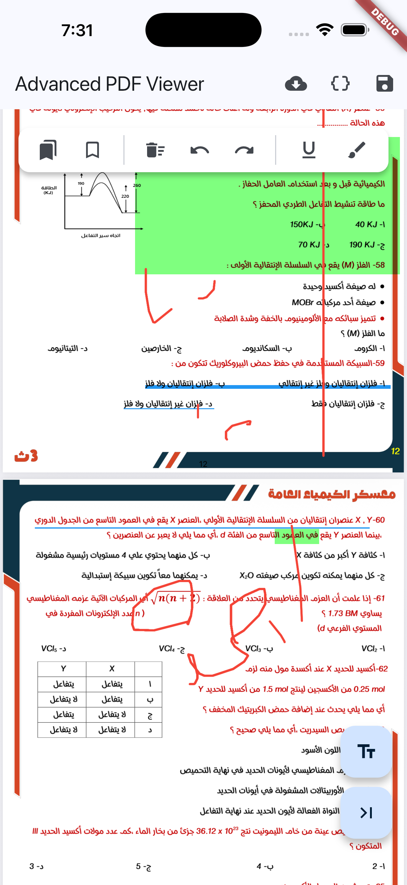
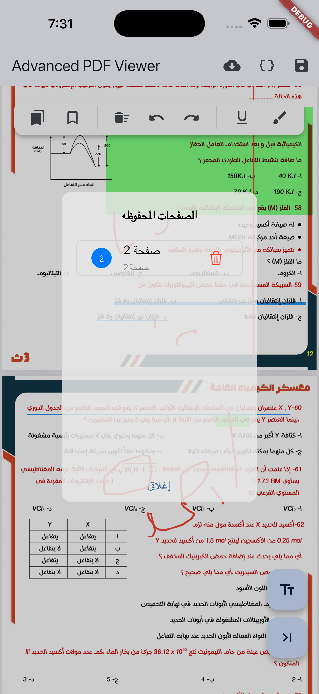
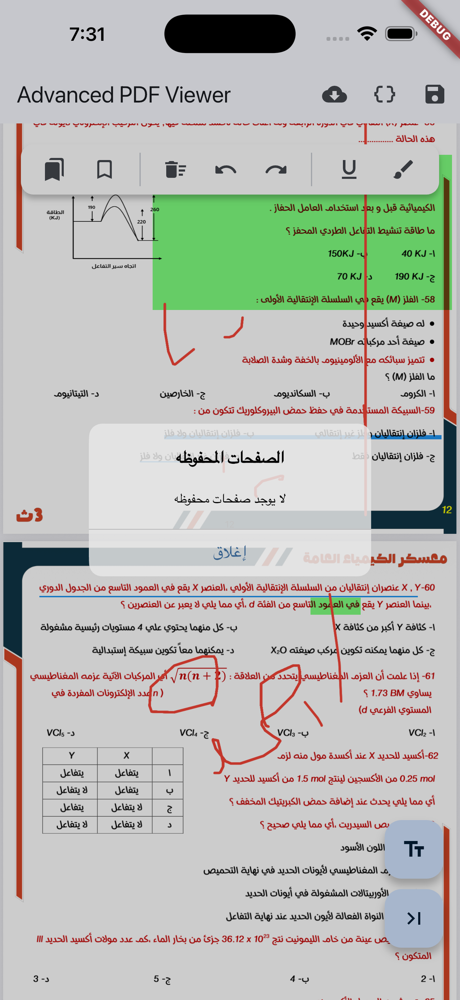

# Advanced PDF Viewer

A high-performance, feature-rich PDF viewer for Flutter with advanced annotation tools, bookmarks, and native support for Arabic/RTL text rendering.

<div style="text-align: center">
    
    
    
    
</div>

## Features

- 🚀 **High Performance**: Uses virtualized rendering (RecyclerView on Android) to handle large PDF files smoothly with minimal memory footprint.
- 🇸🇦 **Arabic & RTL Support**: Built-in Arabic text shaping and BiDi reordering ensures Arabic annotations look perfect and connected.
- 🔖 **Bookmarks System**: Save, view, and navigate bookmarks with persistent storage.
- 🌍 **Internationalization**: Full English & Arabic support with RTL layout.
- 🔔 **Smart Notifications**: Beautiful, animated overlay toasts for actions.
- ✏️ **Advanced Annotations**:
  - **Free-hand Drawing**: Smooth pen tool for sketching and signing.
  - **Text Notes**: Add text anywhere on the page with font embedding support.
  - **Highlight & Underline**: Precise markup tools.
- 🧲 **Snap-to-Text**: Highlights and underlines automatically detect and snap to the nearest text line for perfect alignment.
- 💾 **Save & Persistence**: Save modified PDFs with your annotations baked in. Supporting mixed language (Arabic/English) text embedding.
- 🔒 **Secure Storage**: Option to load PDFs without caching or saving to local storage (Stream-to-Temp-Transfer).
- 🔢 **Page Counter**: Optional page numbering support on both Android and iOS.
- 🛡️ **Enhanced Security**: Disables copying, sharing, and other text interactions on iOS to protect content.
- 🛠️ **Customizable Toolbar**: Easy-to-use toolbar with Undo/Redo support and full-screen mode.

## Getting started

Add the package to your `pubspec.yaml`:

```yaml
dependencies:
  advanced_pdf_viewer:
```

### Android Setup

Add internet and storage permissions to your `AndroidManifest.xml` if you plan to load network PDFs or save to storage:

```xml
<uses-permission android:name="android.permission.INTERNET" />
```

## Usage

### Simple Usage

```dart
import 'package:advanced_pdf_viewer/advanced_pdf_viewer.dart';

// Load from Network
AdvancedPdfViewer.network('https://example.com/sample.pdf')

// Load from Bytes
AdvancedPdfViewer.bytes(pdfUint8List)

// Load Securely (No Local Storage)
AdvancedPdfViewer.network(
  'https://example.com/sensitive.pdf',
  useCache: false, // File is deleted immediately after opening
)
```

### Advanced Usage with Bookmarks & i18n

```dart
final controller = AdvancedPdfViewerController();

AdvancedPdfViewer.network(
  'https://example.com/sample.pdf',
  controller: controller,
  config: PdfViewerConfig(
    // Enable Bookmarks
    enableBookmarks: true,
    showBookmarkButton: true,
    bookmarkStorageKey: 'my_pdf_id_123', // Optional: unique ID for persistence

    // Set Language (English or Arabic)
    language: PdfViewerLanguage.arabic, // Switches UI to Arabic + RTL

    // Page Changed Callback
    onPageChanged: (int page) => print('Current page: $page'),
  ),
)
```

## Repository

Find the source code and contribute at: [https://github.com/AhmadAbbas8/advanced_pdf_viewer](https://github.com/AhmadAbbas8/advanced_pdf_viewer)

## Configuration

The `PdfViewerConfig` class allows you to customize the behavior and appearance of the viewer.

| Property           | Description                         | Default         |
| ------------------ | ----------------------------------- | --------------- |
| `enableBookmarks`  | Enable the bookmarking system       | `false`         |
| `language`         | UI Language (`english` or `arabic`) | `null` (Auto)   |
| `toolbarColor`     | Background color of the toolbar     | `Colors.white`  |
| `drawColor`        | Primary color for the drawing tool  | `Colors.red`    |
| `highlightColor`   | Color used for text highlighting    | `Colors.yellow` |
| `showUndoButton`   | Enable/Disable the undo button      | `true`          |
| `allowFullScreen`  | Show full screen toggle             | `true`          |
| `enablePageNumber` | Show page number indicator          | `false`         |
| `onPageChanged`    | Callback when page changes          | `null`          |

## License

This project is licensed under the MIT License - see the [LICENSE](LICENSE) file for details.
