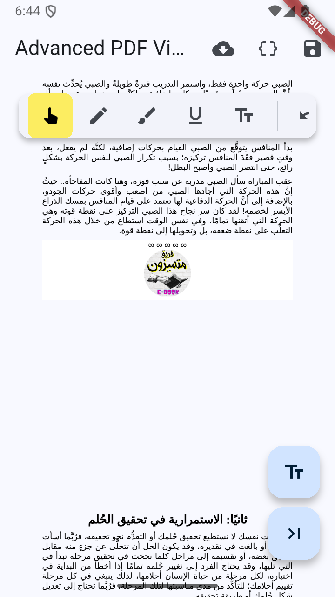

# Advanced PDF Viewer

A high-performance, feature-rich PDF viewer for Flutter with advanced annotation tools and native support for Arabic/RTL text rendering.



## Features

- 🚀 **High Performance**: Uses virtualized rendering (RecyclerView on Android) to handle large PDF files smoothly with minimal memory footprint.
- 🇸🇦 **Arabic & RTL Support**: Built-in Arabic text shaping and BiDi reordering ensures Arabic annotations look perfect and connected.
- ✏️ **Advanced Annotations**:
    - **Free-hand Drawing**: Smooth pen tool for sketching and signing.
    - **Text Notes**: Add text anywhere on the page with font embedding support.
    - **Highlight & Underline**: Precise markup tools.
- 🧲 **Snap-to-Text**: Highlights and underlines automatically detect and snap to the nearest text line for perfect alignment.
- 💾 **Save & Persistence**: Save modified PDFs with your annotations baked in. Supporting mixed language (Arabic/English) text embedding.
- 🔒 **Secure Storage**: Option to load PDFs without caching or saving to local storage (Stream-to-Temp-Transfer).
- 🛠️ **Customizable Toolbar**: Easy-to-use toolbar with Undo/Redo support and full-screen mode.

## Getting started

Add the package to your `pubspec.yaml`:

```yaml
dependencies:
  advanced_pdf_viewer: ^0.1.0
```

### Android Setup

Add internet and storage permissions to your `AndroidManifest.xml` if you plan to load network PDFs or save to storage:

```xml
<uses-permission android:name="android.permission.INTERNET" />
```

## Usage

### Simple Usage

```dart
import 'package:advanced_pdf_viewer/advanced_pdf_viewer.dart';

// Load from Network
AdvancedPdfViewer.network('https://example.com/sample.pdf')

// Load from Bytes
AdvancedPdfViewer.bytes(pdfUint8List)

// Load Securely (No Local Storage)
AdvancedPdfViewer.network(
  'https://example.com/sensitive.pdf',
  useCache: false, // File is deleted immediately after opening
)
```

### Advanced Usage with Controller

```dart
final controller = AdvancedPdfViewerController();

AdvancedPdfViewer.network(
  'https://example.com/sample.pdf',
  controller: controller,
  config: PdfViewerConfig(
    toolbarColor: Colors.blueAccent,
    showTextButton: true,
    onFullScreenInit: () => print('Entered Full Screen'),
  ),
)

// Later, you can call methods on the controller
void _save() async {
  final bytes = await controller.savePdf();
  // Save bytes to file...
}
```

## Repository

Find the source code and contribute at: [https://github.com/AhmadAbbas8/advanced_pdf_viewer](https://github.com/AhmadAbbas8/advanced_pdf_viewer)

## Configuration

The `PdfViewerConfig` class allows you to customize the behavior and appearance of the viewer.

| Property | Description | Default |
| --- | --- | --- |
| `toolbarColor` | Background color of the toolbar | `Colors.white` |
| `drawColor` | Primary color for the drawing tool | `Colors.red` |
| `highlightColor` | Color used for text highlighting | `Colors.yellow` |
| `showUndoButton` | Enable/Disable the undo button | `true` |
| `allowFullScreen` | Show full screen toggle | `true` |

## License

This project is licensed under the MIT License - see the [LICENSE](LICENSE) file for details.
